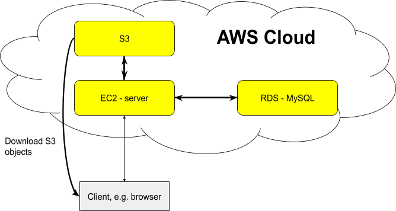

This repo aims to play with public cloud infrastructures to build cloud native services. 
A toy example is used now which needs storage, databases, dataflow pipelines, etc. To make it fun, image it is the backend of Advertisement systems. The basic architecture is below: 
   

Currently, some prelimnary experiments are explored in Amazon Web Services and Google Cloud Platform. Please see details in `aws-ads` and `gcp-ads` directories. Welcome suggests and ideas on building representative could native services. 
