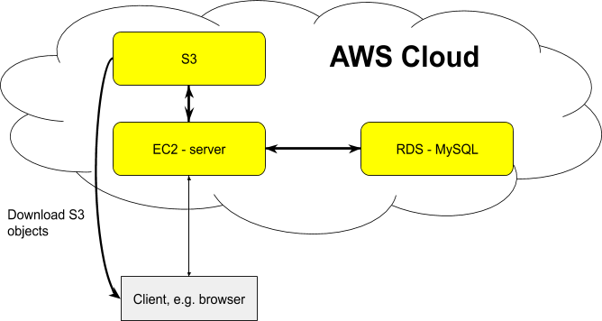

# Table of Contents

-   [Architecture](#org690aff4)
    -   [Used AWS Service:](#orgceb377f)
-   [Run the Ads-AWS](#org54683cd)
    -   [Setup AWS environment](#org527db14)
    -   [Run the Ads server w/o docker](#org0c78858)
    -   [Run the Ads server w/ docker](#orgd283ead)
    -   [Publish your docker images (local or one EC2 VM)](#org53e7698)

# Architecture

   

## Used AWS Service:

-   EC2
-   S3
-   RDS: MySQL
-   Docker
-   EKS

# Run the Ads-AWS

## Setup AWS environment

-   `mkdir ~/.config`    # save ssh key for log into EC2 vms
-   `mkdir ~/.aws`       # save aws related credentials into a file call `credentials`.

## Run the Ads server w/o docker

-   run `./sync.sh` to transfer the code into EC2 VM  (Remember to update the machine IP)
-   `./connect.sh  vm_name`
-   `./run_server.sh`
-   access the service in browser: `ip:8080`

## Run the Ads server w/ docker

-   run `./sync.sh` to transfer the code into EC2 VM  (Remember to update the machine IP)
-   `./connect.sh  vm_name`
-   In host VM: `./docker_run.sh KEY_ID  KEY`
-   In any browser: `ip:8080`

## Publish your docker images (local or one EC2 VM)

-   Build image: `./docker_build.sh`
-   publish the docker image to DockerHub: `./docker_publish.sh`

